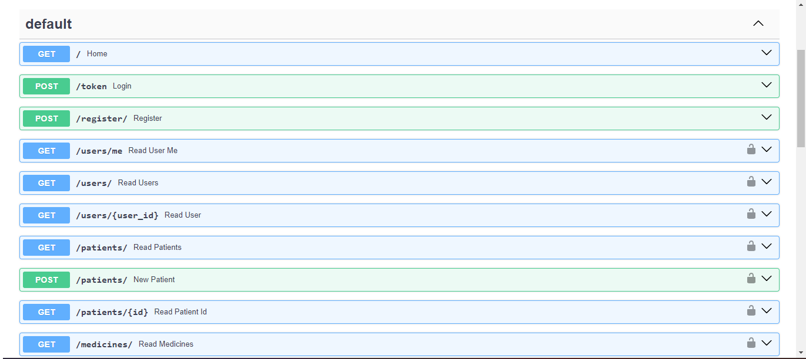
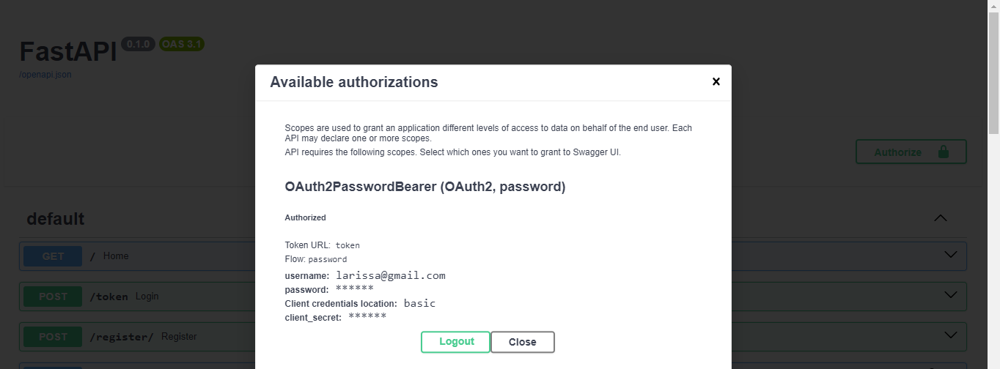

Essa API tem como propósito fazer uma contagem de comprimidos e amarzenar dados de pacientes.

Foi desenvolvida usando FastAPI e MySQL com 4 tabelas

Possui um sistema de autenticação de usuário usando AuthPaswordBearer e JWT 
Com essa API consegue ter 
- lista de paciente com Nome CPF e Anotações
- Lista de Medicamento com nome e quantidade
- Lista que mostra Paciente vinculado com cada medicamento
- Lista de usuario cadastrado no sistema e quem está logado no momento
- Pode registrar ou editar pacientes/medicamentos
- vinular medicamentos com os pacientes
Estas informações/ações só estão disponiveis a usuários logados

A API se encontrada hospedada no servidor railway e ainda está em desenvolvimento
ainda será agregada o FrontEnd

https://med-api-production.up.railway.app/docs#/

